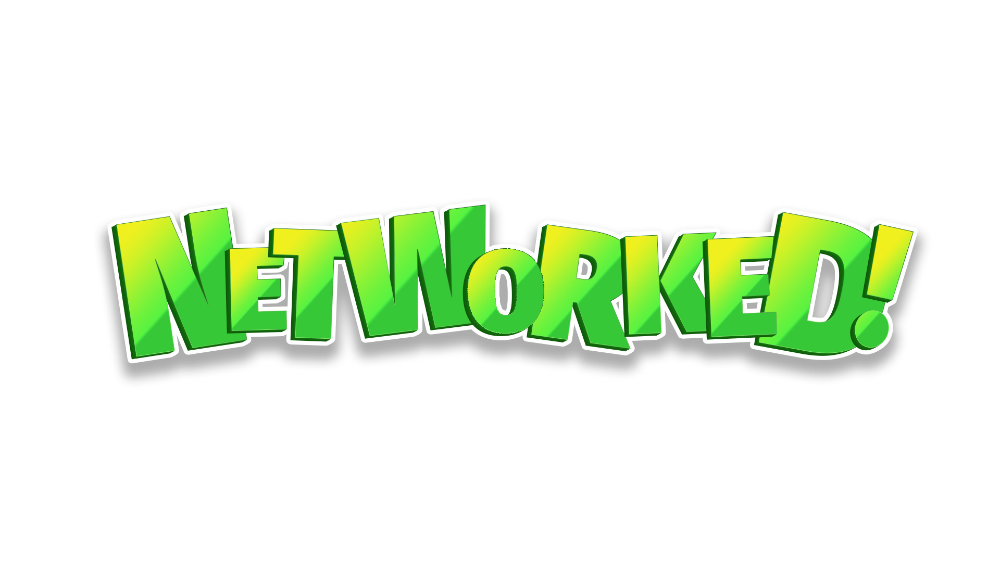
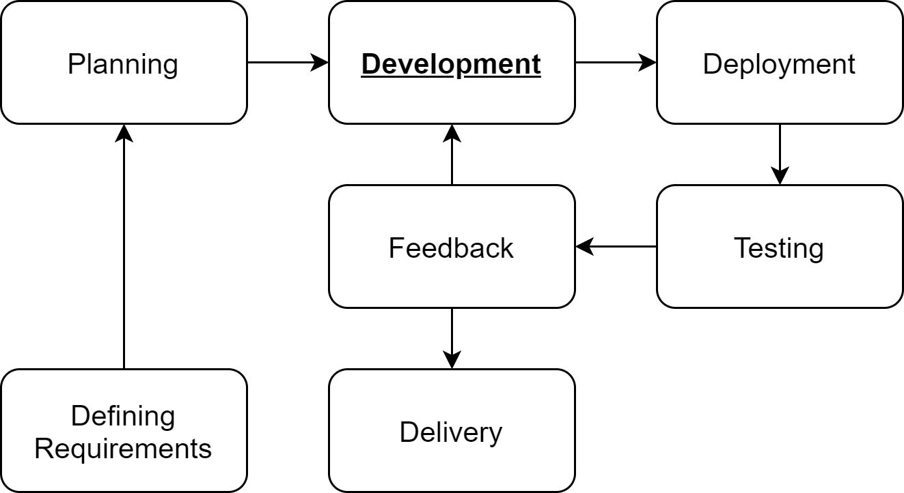
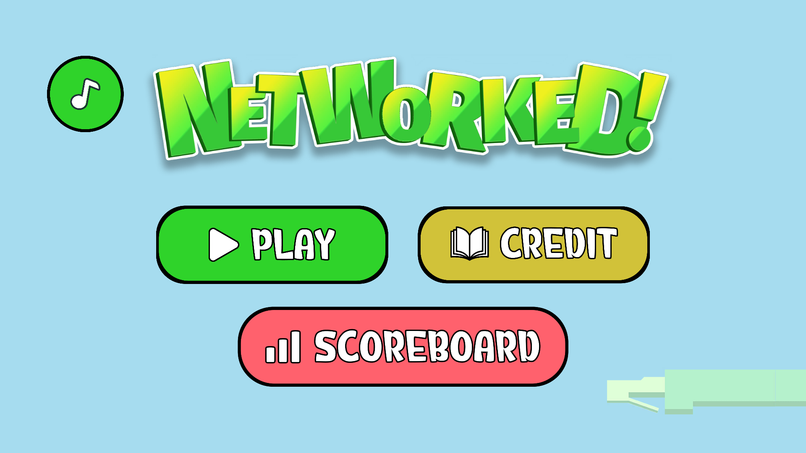
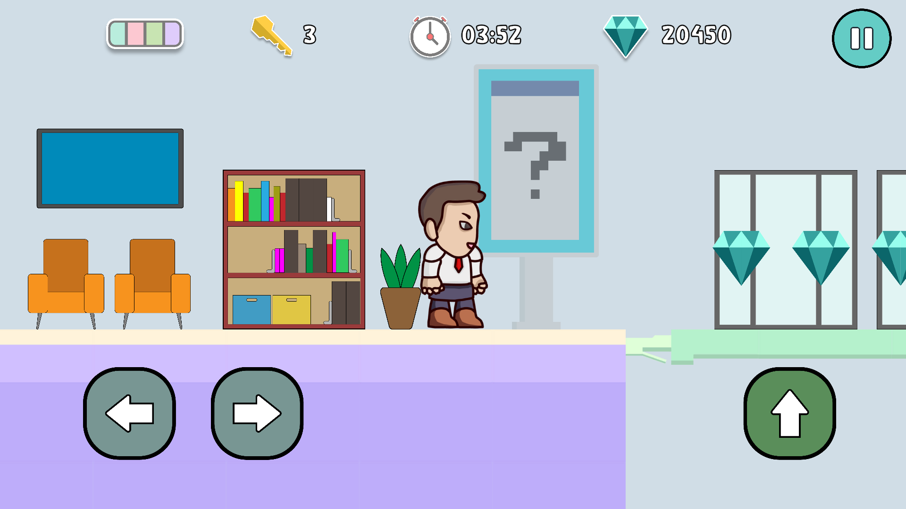
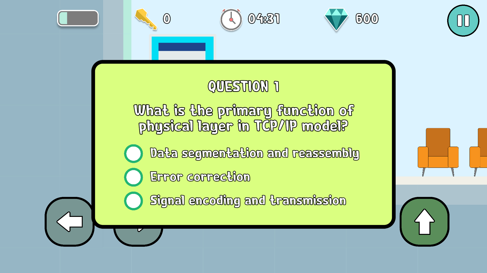
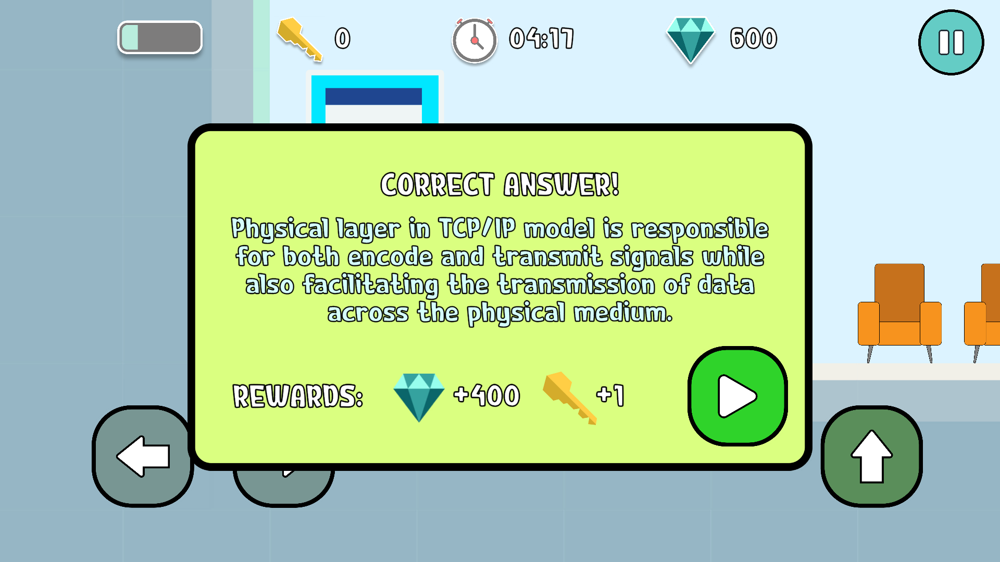
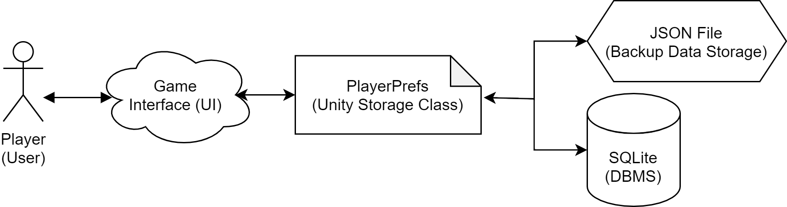
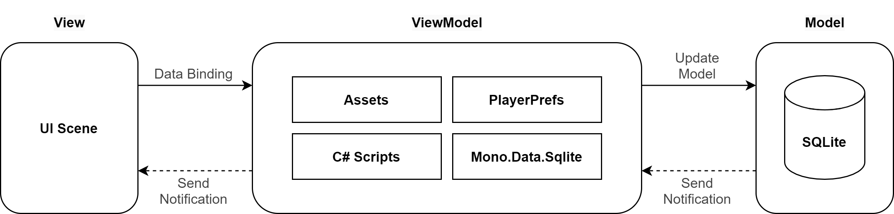
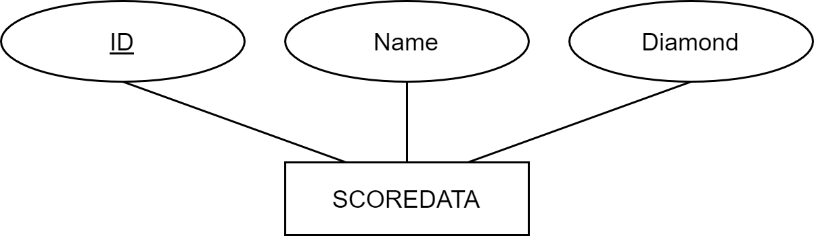
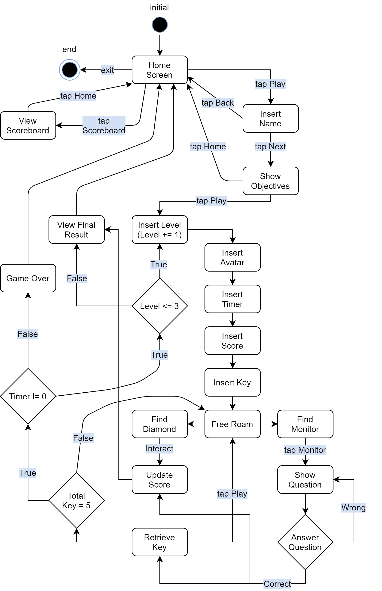

# NetWorked!: A Gamified E-Learning Mobile Application for Internetworking Course

 <!-- Replace with your actual banner image -->

## Project Background
NetWorked! is an innovative e-learning application designed to educate computer science students about the foundation or basic of network syllabus, with a specific focus on the five layers of the TCP/IP model. NetWorked! seeks to improve learning outcomes by improving student engagement, motivation and retention through the use of interactive game design elements and gamification approaches. The application contains four separate levels, each of which focuses on one of the five TCP/IP layers, including topics covering the Physical and Data Link layers, Network layer, Transport layer, and Application layer. NetWorked! offers a more immersive and engaging learning experience with its dynamic and effective approach to network education.

## Problem Statement
- Existing e-learning applications for internetworking courses primarily rely only on quiz games or tutorials.
- Lack of interest, enjoyment and entertainment for students to play the quiz games or tutorials in e-learning application.

## Objective
- To develop an immersive and engaging e-learning game of e-learning application for internetworking courses.
- To design a dynamic and interactive game design elements including points system, character or avatar, storyboards or narratives as well as timer.

## Inventiveness and Methodology
- Development of an e-learning mobile application using Agile methodology.
- The development stage emphasizes both continuous improvement and adaptability.
- 🎮 4 interactive levels covering all 5 TCP/IP layers
- 📚 Gamified learning with points system & character avatar
- ⏱️ Timed challenges for enhanced engagement
- 📊 Progress tracking and performance analytics
- 🏆 Achievement system to motivate learners

 <!-- Replace with actual image -->

### Development Stage:
- Writing game storyboard and content.
- Designing game assets and game character using Adobe Illustrator (AI).
- Constructing map levels using Tiled Map Editor.
- Designing game interfaces using Unity Engine (2021.3.25f1).
- Developing game mechanics using C# scripts with Microsoft Visual Studio 2019 IDE.
- Managing SQLite database using DB Browser for SQLite.

## Implementation
 <!-- Replace with actual image -->
*Home Screen / Main Menu UI of NetWorked!*

 <!-- Replace with actual image -->
*Map Interface for Level 4*

 <!-- Replace with actual image -->
*Example of Question Panel*

 <!-- Replace with actual image -->
*Correct Answer's Panel*

## System Design
 <!-- Replace with actual image -->
*Architecture Design*

 <!-- Replace with actual image -->
*MVVM Architecture Diagram*

 <!-- Replace with actual image -->
*ER Diagram*

 <!-- Replace with actual image -->
*State-Transition Diagram*

## Practicality and Usefulness
- Intuitive User Interface (UI) enhances the User Experience (UX), making it easy to for players to navigate and play.
- Provides an optimal balance of question difficulty and duration per level, which ensuring an enjoyment and appropriate challenge for players.
- Offers the platform with leisurely learning experiences to computer network students.
- Available for free download on the Android platform, which allowing students to engage in dynamic learning experiences at anytime and anywhere.

## Impact on Learning
- Improving player's engagement, motivation as well as retention especially for computer network's students.
- Offers a unique benefit by incorporating questions that serves as a comprehensive study guide and a valuable academic resource.
- Assists students in better understanding the TCP/IP layer, which is the core and most basic topic for grasping the fundamentals of internetworking.

## Commercialization Potential
NetWorked! offers students free downloads for the Android platform via the Google Play Store, which allows students to participate in engaging dynamic learning experiences at any time and anywhere.

## How to Use
Download [NetWorked! Version 1.3.1.apk](NetWorked! Version 1.3.1.apk) to play the e-learning game.

## Developed By
- **Muhammad Aliff Fikri bin Anuar Hidayat**
- **Dr. Idawaty Ahmad**

## Updates
**Last update:** 10 January 2024 (APK file)
